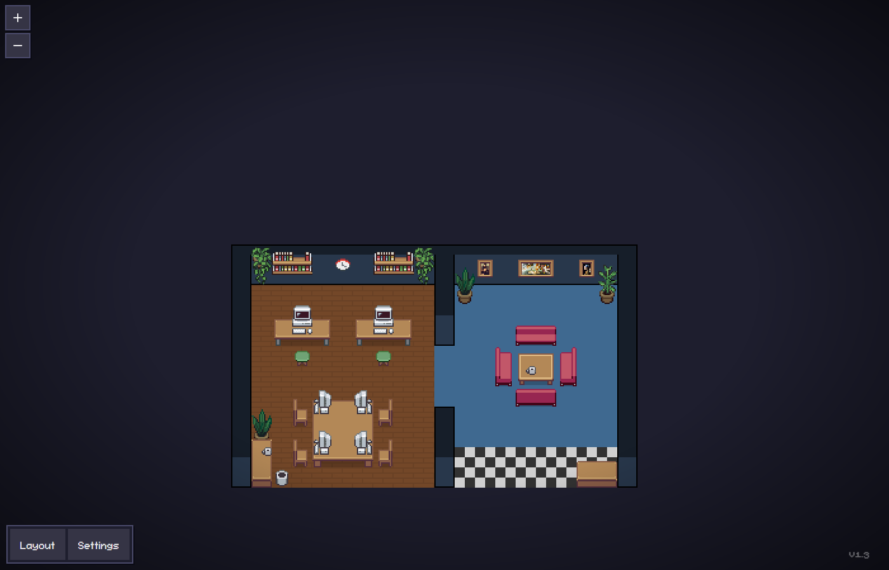

# 멀티 에이전트 픽셀 오피스

OpenRouter LLM을 활용한 멀티 에이전트 시스템입니다.  
여러 AI 에이전트가 픽셀 아트 오피스 화면에 캐릭터로 등장해 실제로 일하는 모습을 보여줍니다.


---

## 실행 화면



> AI 에이전트 3명이 픽셀 오피스에서 각자 파일을 읽고, 코드를 수정하고, 명령을 실행하는 모습

---

## 개요

- **에이전트 3명** (김대리, 박사원, 이주임)이 각자 LLM을 호출해 행동을 결정합니다
- 결정된 행동(파일 읽기, 코드 수정, 명령 실행 등)을 픽셀 오피스 서버에 훅으로 전달합니다
- 브라우저에서 캐릭터들이 걸어다니고, 타이핑하고, 파일을 읽는 애니메이션이 재생됩니다
- OpenRouter API 레이트리밋 발생 시 데모 모드로 자동 전환됩니다

---

## 실행 방법

### 1. 의존성 설치

```bash
npm install
cd webview-ui && npm install && npm run build && cd ..
npm run build
```

### 2. 서버 시작

```batch
start-server.cmd
```

또는 직접 실행:

```bash
node dist/cli.js
```

### 3. 드라이버 시작

```batch
start-driver.cmd
```

OpenRouter API 키를 입력하라는 메시지가 나옵니다.  
또는 환경변수로 미리 설정:

```batch
set OPENROUTER_API_KEY=sk-or-v1-...
node_modules\.bin\tsx.cmd driver/src/index.ts
```

### 4. 오피스 접속

브라우저에서 [http://127.0.0.1:3100](http://127.0.0.1:3100) 열기

---

## 에이전트 설정

[driver/src/config.ts](driver/src/config.ts) 에서 에이전트 이름과 모델을 변경할 수 있습니다.

```typescript
export const AGENTS: AgentConfig[] = [
  { name: '김대리', model: 'meta-llama/llama-3.2-3b-instruct:free' },
  { name: '박사원', model: 'google/gemma-4-26b-a4b-it:free' },
  { name: '이주임', model: 'qwen/qwen3-coder:free' },
];
```

OpenRouter에서 무료로 사용할 수 있는 모델 목록:  
[https://openrouter.ai/models?q=free](https://openrouter.ai/models?q=free)

---

## 구조

```
driver/
  src/
    index.ts          진입점 — 에이전트 N명 병렬 시작
    agent.ts          에이전트 루프 — LLM 호출 → 훅 전송
    config.ts         에이전트 이름/모델 설정
    openrouter.ts     OpenRouter API 클라이언트
    office.ts         픽셀 오피스 서버 연동 (훅 POST, JSONL 생성)
    actions.ts        행동 파싱 및 도구 매핑
    demoFallback.ts   레이트리밋 발생 시 데모 행동 풀
    requestQueue.ts   LLM 요청 직렬화 큐 (레이트리밋 방지)
    logger.ts         한국어 컬러 로그

start-server.cmd      픽셀 오피스 서버 시작 스크립트
start-driver.cmd      드라이버 시작 스크립트
```

---

## 기반 프로젝트

[Pixel Agents](https://github.com/pixel-agents-hq/pixel-agents) — AI 에이전트를 픽셀 아트 캐릭터로 시각화하는 VS Code 확장

---

## 라이선스

MIT
